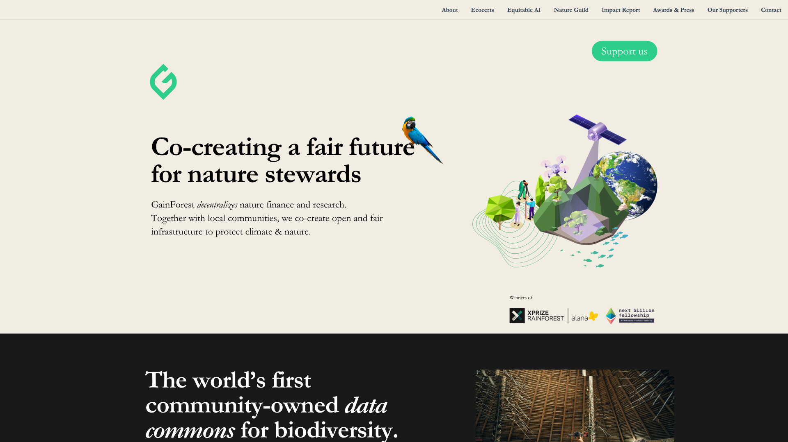
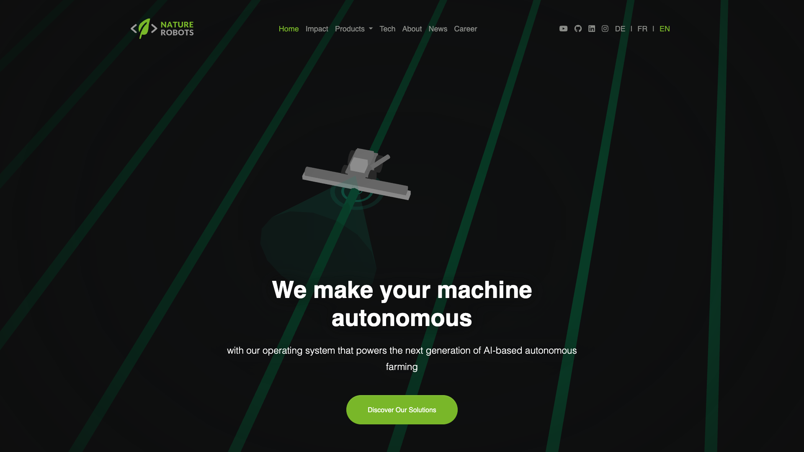
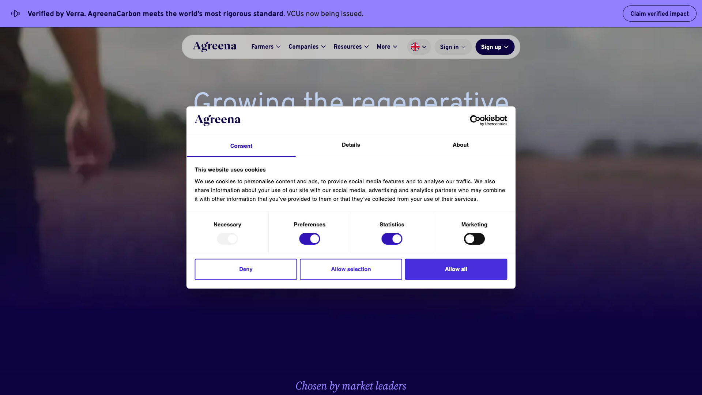
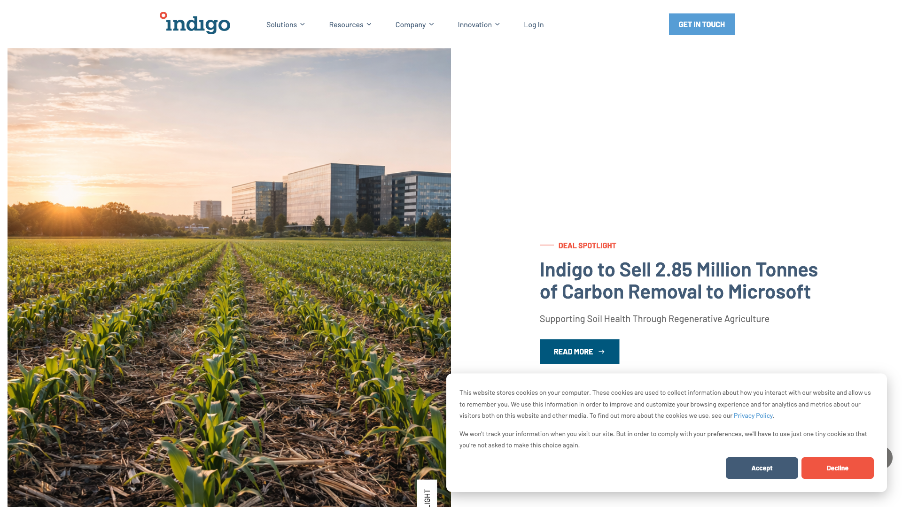

# Regenerative Agriculture Startups

## GainForest

**Website:** [https://gainforest.earth](https://gainforest.earth)

GainForest is a nonprofit that won the $10M XPRIZE Rainforest competition by combining AI with indigenous knowledge systems. They've deployed drones, satellite imagery, and machine learning to monitor forest health across 30 indigenous communities in South America, Africa, and Asia. They built Tainá, a Telegram bot that allows indigenous communities to share spoken knowledge in their own languages, training AI models on ancestral wisdom rather than extracting from it.

---

## Nature Robots

**Website:** [https://naturerobots.com/en/](https://naturerobots.com/en/)

Nature Robots is a €6.5 million EU-backed startup building autonomous robots specifically for regenerative agroforestry. While most ag-tech focuses on monoculture efficiency, Nature Robots designs for complex farming systems—bio-intensive polycultures that actually rebuild soil health. They are a spin-off of the German Research Center for Artificial Intelligence (DFKI).

---

## Agreena

**Website:** [https://agreena.com](https://agreena.com)

Agreena in Denmark is using AI to help farmers earn carbon credits from regenerative practices. Their platform monitors soil carbon sequestration and ensures compliance with carbon reduction regulations—solving the verification problem that has blocked private investment in nature-based solutions. They are Verra-verified and operate across 20 countries in Europe with ~5 million+ hectares transitioning with their platform.

---

## Indigo Agriculture

**Website:** [https://www.indigoag.com](https://www.indigoag.com)

Indigo Agriculture built a marketplace that connects regenerative farmers directly with buyers, using AI to measure and verify carbon sequestration in soil. Farmers generate income from doing the right thing because AI makes the impact measurable. They work with major corporations across 15 countries, with a 20M acre global footprint, 1M tonnes of GHG reductions and removals, and 96B gallons of water saved.
